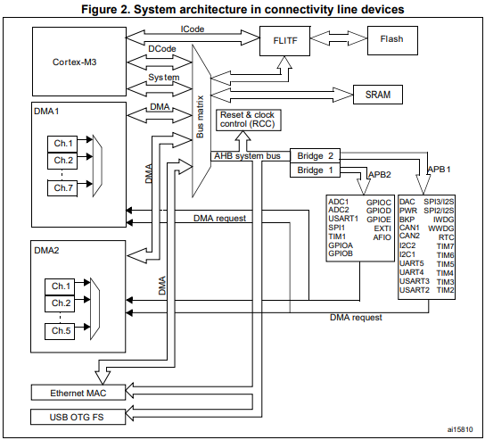
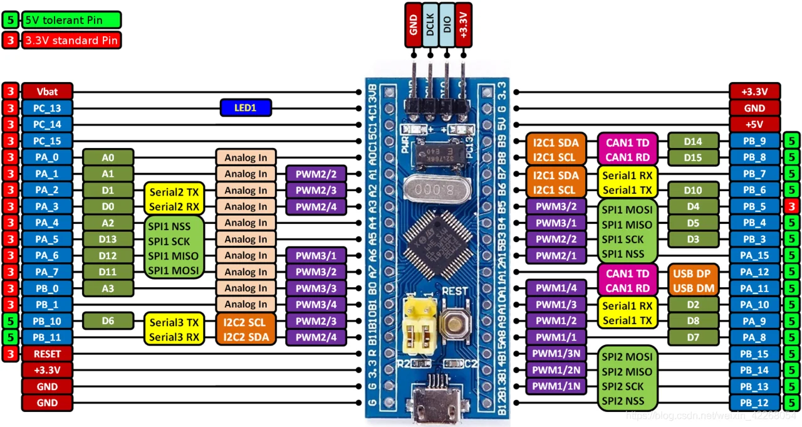

# Electrónica IV - TP - HAL Parte 1 - Memoria de Diseño

Alumno: Paula Diaz Romero

## Especificaciones

El objetivo de este trabajo práctico es diseñar una capa de abstracción de hardware (HAL) que permita controlar los pines de entrada/salida y el temporizador de la BluePill. Además, se implementará para hacer parpadear el led integrado de la placa a una frecuencia de 500 [ms].

## Diseño de la HAL

Los pines de entrada/salida son controlados por el periférico GPIO conectado al bus periférico APB2 del microcontrolador. Los periféricos de los buses APB1 y APB2 cuentan con una habilitación de reloj comandada por el periférico RCC, el cual permite controlar la frecuencia del reloj. Para hacer uso de esto, primero activamos el reloj.




El micro tiene puertos desde la A hasta la E, pero en la bluepill solo se puede acceder a los puertos desde la A hasta la C. Primero, implementaremos las características necesarias para completar el programa de parpadeo, por lo cual investigamos cuál es el puerto y pin donde está conectado el led integrado en la bluepill. En la siguiente imagen, se observa que el LED se encuentra en el PC13 (pin 13 del puerto C) y es el que debemos configurar.




Según el manual de referencia de la familia del microcontrolador (RM0003, 2021, seccion 1.3.7), el reloj del puerto GPIOC se habilita poniendo en 1 el bit 4 (IOCEN) del registro de offset 0x18 (APB2ENR) en el periférico RCC, de dirección base 0x40021000, según la hoja de datos STM32F103x.

Para poner en 0 o en 1 bits individuales en un registro, es necesario hacer una operación de máscara. En el siguiente código se muestra como poner en 0 los bits marcados como 1 con mascaraReset y luego como se ponen en 1 los bits marcados como 0 con mascaraSet:

```c
enum{mascaraReset = 0xF (3*4),
        mascaraSet   = 0b0100 (3*4)};
        palabra = (palabra & ~mascaraReset) | mascaraSet;
```

Luego, para habilitar el reloj del puerto GPIOC, utilizamos las definiciones de la librería *'stm32f1xx.h'*:

```c
static void inicializaPuertoC(void)
{
    RCC->APB2ENR = RCC->APB2ENR | RCC_APB2ENR_IOPCEN;
}
```

## Interfaz abstracta

Nuestra interfaz abstracta no debe dar ningún detalle sobre el hardware o las librerías utilizadas. Para ello, utilizaremos el concepto de 'handle' para referirnos de forma abstracta a los recursos utilizados. De esta manera, definiremos los handle que nos permitan acceder a los pines como miembros de un enum de c y las operaciones para los pines:

```c
typedef enum HandlePin{
    Pin_LED,
    Pin_NUM_HANDLES
}HandlePin;

void Pin_ponerModoSalida(HandlePin pin);
void Pin_ponerEstadoBajo(HandlePin pin);
void Pin_ponerEstadoAlto(HandlePin pin);
bool Pin_consultarEstado(HandlePin pin);
void Pin_invertirEstado(HandlePin pin);
```

Los pines son descriptos mediante handles, números enteros, pero, a la hora de realizar la implementacion necesitamos un descriptor de pin, el cual debe ser capaz de realizar las operaciones previstas por la interfaz. Para implementar las operaciones en un pin se necesita tener acceso a los registros de control del mismo (mediante GPIO), al número de pin y a la rutina de habilitación de reloj definida con anterioridad. En el siguiente código definimos la estructura de un pin y la tabla de descriptores que asocia un descriptor a cada handle:

```c
typedef struct Pin{                 
    GPIO_TypeDef *puerto;           
    int numeroPin;                  
    void (*inicializa)(void); 
}Pin;

/* Tabla de descriptores */
static const Pin descriptores[Pin_NUM_HANDLES]={
    [Pin_LED] = {.puerto=GPIOC, .numeroPin=13, .inicializa=inicializaPuertoC}
};
```

Finalmente, en el programa principal se implementará el siguiente código que nos permita controlar los pines y activar el temporizador para encender el led de la BluePill:

```c
int main(void)
{
    Pin_ponerModoSalida(Pin_LED);
    Pin_ponerEstadoAlto(Pin_LED);
    SysTick_init();

    for(;;){
        SisTick_esperaMilisegundos(500);
        Pin_invertirEstado(Pin_LED);
    }
    return 0;
}
```

## Referencias

- *CMSIS-core* (2024) https://arm-software.github.io/CMSIS_6/latest/Core/group__SysTick__gr.html
- *Placa de desarrollo STM32F103x* (2023). https://reversepcb.com/stm32f103c8t6/
- *RM0008 Reference Manual* (2021) ST Microelectronics. https://www.st.com/resource/en/reference_manual/cd00171190-stm32f101xx-stm32f102xx-stm32f103xx-stm32f105xx-and-stm32f107xx-advanced-arm-based-32-bit-mcus-stmicroelectronics.pdf